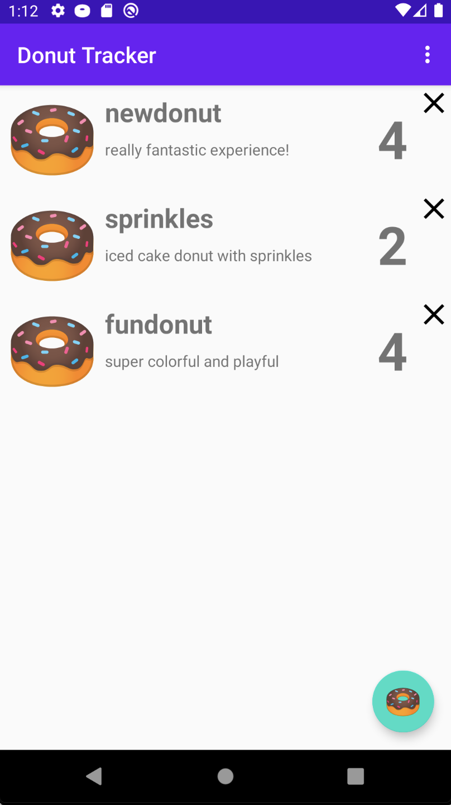

MAD Skills Navigation Sample (Donut Tracker)
==============================================

This sample shows the features of Navigation component highlighted by the Navigation
episodes in the MAD Skills series of [videos](https://www.youtube.com/user/androiddevelopers) 
and [articles](https://medium.com/androiddevelopers). Specifically, episodes
2, 3, andd 4 walk through code from this sample.

### Features

This sample showcases the following features of the Navigation component:

 * Dialog destinations (episode 2)
 * Using SafeArgs to pass data between destinations (episode 3)
 * Navigating via shortcuts and notifications with Deep Links (episode 4)

### Screenshots

### Other Resources

 * For an overview of using Navigation component, check out 
 [Get started with the Navigation component](https://developer.android.com/guide/navigation/navigation-getting-started)
 * Consider including the [Navigation KTX libraries](https://developer.android.com/topic/libraries/architecture/adding-components#navigation)
  for more concise uses of the Navigation component. For example, calls to `Navigation.findNavController(view)` can
 be expressed as `view.findNavController()`.

License
-------

Copyright 2020 The Android Open Source Project, Inc.

Licensed to the Apache Software Foundation (ASF) under one or more contributor
license agreements.  See the NOTICE file distributed with this work for
additional information regarding copyright ownership.  The ASF licenses this
file to you under the Apache License, Version 2.0 (the "License"); you may not
use this file except in compliance with the License.  You may obtain a copy of
the License at

http://www.apache.org/licenses/LICENSE-2.0

Unless required by applicable law or agreed to in writing, software
distributed under the License is distributed on an "AS IS" BASIS, WITHOUT
WARRANTIES OR CONDITIONS OF ANY KIND, either express or implied.  See the
License for the specific language governing permissions and limitations under
the License.