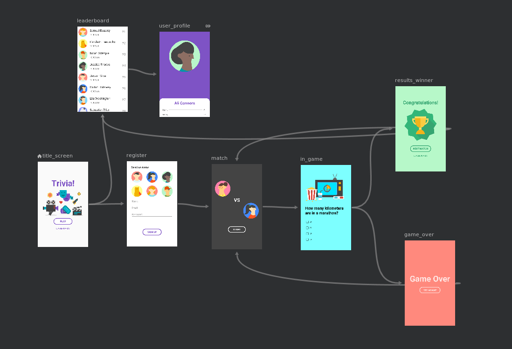

Android Architecture Components Navigation Basic Sample
==============================================

### Features

This sample showcases the following features of the Navigation component:

 * Navigating via actions
 * Transitions
 * Popping destinations from the back stack
 * Arguments (profile screen receives a user name)
 * Deep links (`www.example.com/user/{user name}` opens the profile screen)

### Screenshots
 

### Other Resources

 * Particularly In Java, consider using `Navigation.createNavigateOnClickListener()` to quickly
 create click listeners.
 * Consider including the [Navigation KTX libraries](https://developer.android.com/topic/libraries/architecture/adding-components#navigation)
  for more concise uses of the Navigation component. For example, calls to `Navigation.findNavController(view)` can
 be expressed as `view.findNavController()`.

### Tests

This sample contains UI tests that can be run on device (or emulator) or on the host
(as a JVM test, using Robolectric). As of Android Studio (3.3.1), running these tests will default
to Android Instrumented test (device or emulator). In order to run them with Robolectric you have
two options:
 * From the command line, running `./gradlew test`
 * From Android Studio, creating a new "Android JUnit" run configuration and targeting "all
 in package" or a specific class or directory.

License
-------

Copyright 2018 The Android Open Source Project, Inc.

Licensed to the Apache Software Foundation (ASF) under one or more contributor
license agreements.  See the NOTICE file distributed with this work for
additional information regarding copyright ownership.  The ASF licenses this
file to you under the Apache License, Version 2.0 (the "License"); you may not
use this file except in compliance with the License.  You may obtain a copy of
the License at

http://www.apache.org/licenses/LICENSE-2.0

Unless required by applicable law or agreed to in writing, software
distributed under the License is distributed on an "AS IS" BASIS, WITHOUT
WARRANTIES OR CONDITIONS OF ANY KIND, either express or implied.  See the
License for the specific language governing permissions and limitations under
the License.
